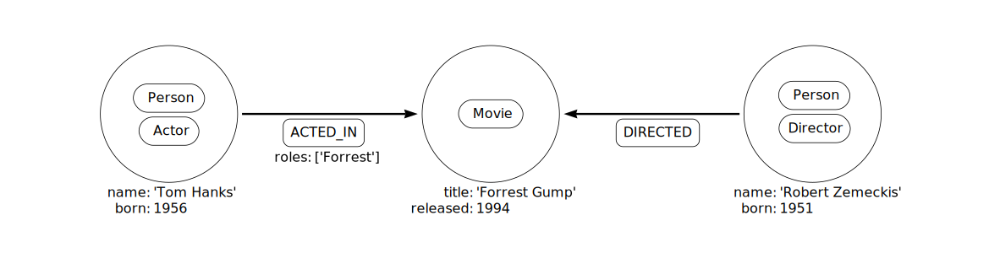

# Technical Interview
In this task you will work with data that contains information and metadata on people and geographical locations for a fictional social network platform. The data is in tabular form, available in CSV format. This task is divided into the following four parts:

1. Transform the given tabular data into a knowledge graph -- this will be done by defining an appropriate data model for a graph database (we use Neo4j)
1. Ingest the data into Neo4j
1. Run Cypher queries in Neo4j to retrieve insights from the graph
1. Document your code, queries and findings by committing them into a fork of this repo (please don't work on branches or issue PRs in this repo).

---

# Problem definition

Imagine you are a data engineer working for a fictitious social media company,  *Scattr Inc.*. Scattr is being used **all over the world**, and is trying to analyze its user data to learn in which locations to focus their advertising and marketing efforts. 

Scattr's data is being collected and stored in relational databases, to handle massive transaction volumes. However, the head of engineering at Scattr has realized that a number of questions being posed by the marketing team involve *connected* data (i.e., data that showcases rich relationships between individual data points). To handle this, she poses the question to you: **Can we help answer new business questions by leveraging the power of a knowledge graph?** Because, as we no doubt know, handling a large number of join queries on tables in a relational database for ever-growing data can soon become a gigantic maintenance mess.

So, you embark on this project by working with some sample data dumped from the Scattr database.

## Data
The data provided in the `./data` directory in this repo is in CSV format, and each file contains data such as the primary key ID and the entity in question -- either a person or the name of a geographical location (cities, countries and regions). Here are some key points regarding the data:

* The hierarchy of locations is clear: A city is always located within a country, and a country is always located within a region (and never the other way around).
* `persons.csv` does not contain names of persons for privacy reasons -- just their age is included as metadata, which we would want to query on for business reasons.
* `followers.csv` shows the primary key IDs of persons -- person A follows person B, and not the other way around.
* `person_locations.csv` shows where a person lives -- a person lives in a city (which is located in a country, which is in turn, located in a region).

## Tasks

Don't forget to fork this repo prior to beginning this exercise!
The tasks for this coding exercise are defined below. For task #3, add your answers to the file [SOLUTIONS.md](SOLUTIONS.md).

### Task 1: Design a data model by sketching a schema
The first step in building a knowledge graph is to sketch a "schema". Note that this schema is not the same as one might define in a relational database -- in Neo4j, a schema is simply a sketch of how nodes and edges are related to each other. In our case, nodes are persons or geographical locations, and edges are the relationships between them.

An example schema for actors/movies in Neo4j is shown below. Note how a person node has the metadata "name" and "born" year associated with it.

Source: [Neo4j documentation](https://neo4j.com/docs/getting-started/current/cypher-intro/schema/)

So, **your first task is to design/sketch an appropriate schema for Scattr's social network graph.**

### Task 2: Ingest data into Neo4j
For simplicity, we recommend using [Neo4j's officially supported Python client](https://neo4j.com/developer/python/#python-driver) to perform data ingestion into Neo4j.

* First, install Neo4j locally on your operating system, and start a local database.
* Read in the data from each CSV, and define Cypher queries submitted via transactions in the Python client to build the graph in Neo4j.
* The end result should be a knowledge graph with the appropriate nodes and edges, including metadata fields (e.g., age for a person).

*NOTE:* The primary key IDs in each file should also be reflected as the `<id>` field for each node in Neo4j.

### Task 3: Write Cypher queries
You will write some basic Cypher queries to address some business questions that Scattr's marketing team wants answered. Enter your answers in [SOLUTIONS.md](SOLUTIONS.md).

### Task 4: Cleanup and submission
Clean up your code and commit all your work to a fork of this repo. Make sure to do the following:
* Make sure the repo settings are **private**.
* **Add the following GitHub IDs as collaborators to your private repo fork:** (Repo settings > Collaborators and teams > Add People)
  * prrao87
  * sjhddh
* Save your Python data ingestion code at the main level of this directory, in a file named `build_graph.py`.
* Place a screenshot of your graph schema that you used in the directory `data/img`.
  * You can use the command `call db.schema.visualization` in the Neo4j browser to generate a visual representation of the graph schema.
* Place the solutions to task #3 (Cypher queries) in [SOLUTIONS.md](SOLUTIONS.md).

---

## Tips

* Setup instructions are in the file [SETUP.md](SETUP.md) -- we highly recommend using virtual environments and including a `requirements.txt` that clearly indicates what Python libraries (including versions) you used.
* Read the Neo4j documentation page thoroughly for tips on using their Python client, and how to write queries using the Cypher language.
* Think about code readability and reusability throughout this exercise!

## Bonus points
If you have the time:

* Write your code in a way that considers data ingestion performance into Neo4j.
* OR, if writing the code in a more efficient manner proves to be too time-consuming, list out verbally some additional ways you can try to improve data ingestion performance for large datasets -- enter your answers in the last section of [SOLUTIONS.md](SOLUTIONS.md).

---

🎉 Good luck! 🎉